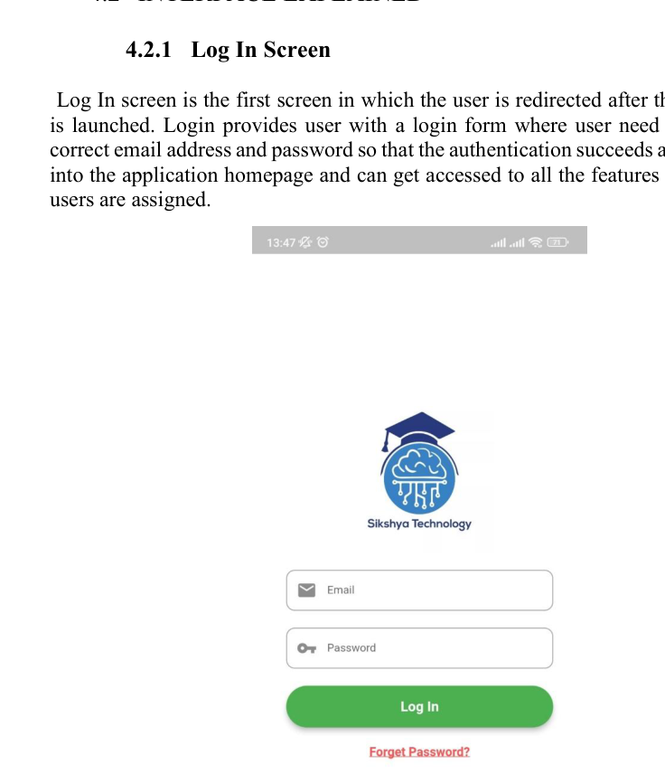
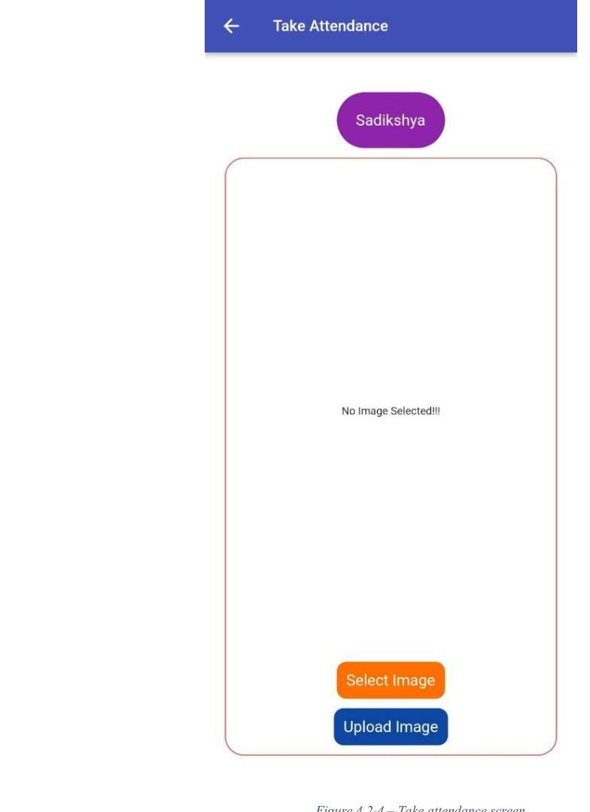
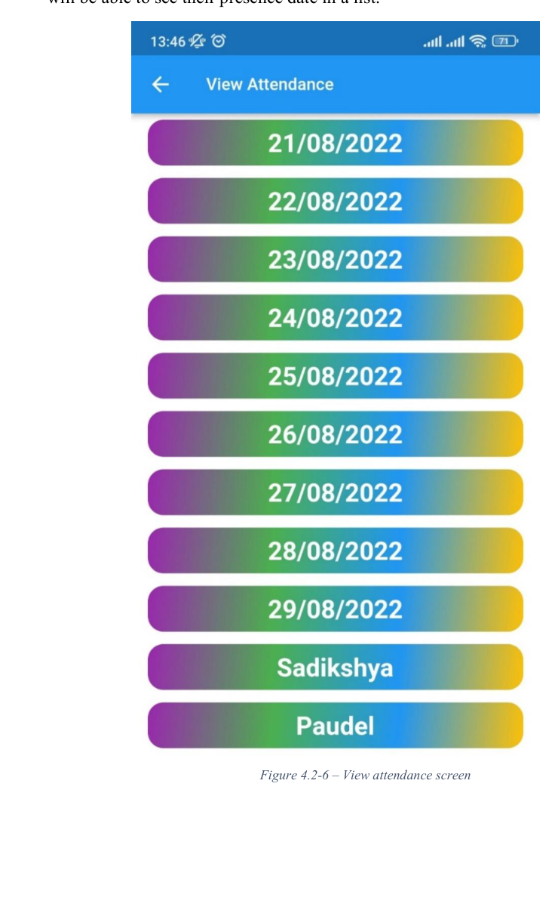
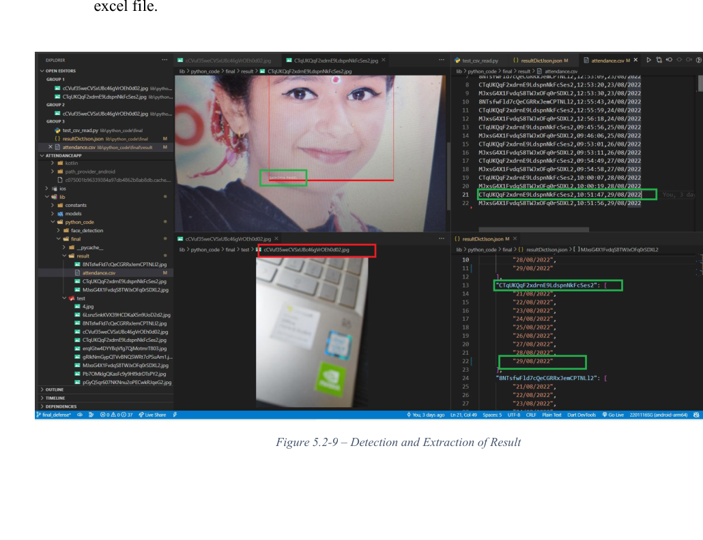

# Face Recognition Attendance System Using Machine Learning & OpenCV

A cross-platform academic project developed for my **Bachelor of Computer Science (Hons.)** to automate student attendance using face detection, facial recognition, image processing, Flutter, Firebase, and CSV/Excel-based attendance records.

> **Academic project:** Face Recognition Attendance System Using Haar Classifier with OpenCV for Educational Institutions  
> **Institution:** Sunway International Business School  
> **Affiliation:** Infrastructure University Kuala Lumpur (IUKL)  
> **Completed:** September 2022

---

## Project Overview

Traditional paper-based attendance systems can be time-consuming and may allow proxy or fraudulent attendance. This project explored a contactless, automated attendance system in which a student's face is captured, detected, processed, recognised, and then used to record attendance.

The solution combines:

- Face detection with OpenCV and Haar-based techniques
- HOG/LBPH-based facial recognition concepts
- Custom facial image dataset creation
- Image preprocessing
- Attendance recording
- Course information
- User authentication
- Flutter-based cross-platform application development
- Firebase/NoSQL backend support
- CSV/Excel-compatible attendance output
- Functional testing using decision tables

---

## Problem Statement

The project was designed around common limitations of face-recognition attendance systems, including:

- Changes in lighting conditions
- Different facial angles
- Facial expressions
- Changes in appearance
- Facial hair
- Scarves and masks
- Difficulty recognising faces in low-light environments

The system aimed to provide a portable attendance solution suitable for educational institutions while reducing dependence on manual attendance sheets.

---

## Project Objectives

The project objectives were to:

1. Develop a smart and portable attendance system capable of capturing images.
2. Use a Haar Classifier to detect human faces.
3. Use HOG and LBPHFaceRecognizer techniques to recognise detected faces from resized grayscale images.
4. Create a custom image dataset during the data collection phase.
5. Extract attendance results into an Excel-compatible file.
6. Provide a graphical view of attendance information.
7. Display course information within the application.

---

## Key Features

- User registration
- User login and authentication
- Password reset
- Course viewing
- Camera access
- Face image capture
- Face detection
- Facial comparison / recognition
- Automated attendance recording
- Attendance history viewing
- Date and time extraction
- CSV/Excel attendance output
- Administrative attendance management
- Firebase-backed user/data storage
- Cross-platform Flutter interface

---

## Application Screens

### Login

The login screen authenticates a registered user using email and password credentials.



### Take Attendance

The attendance screen allows the user to select or capture an image and submit it for detection and recognition.



### Capture Image

The application can access the device camera to capture an image for the recognition process.


### View Attendance

Users can view previously recorded attendance dates.



### Courses

The application displays enrolled courses and provides access to attendance actions.


---

## Computer Vision and Recognition Workflow

The project follows a staged workflow:

```text
User / Student
      |
      v
Open Application
      |
      v
Login / Authentication
      |
      v
Select Course
      |
      v
Take Attendance
      |
      v
Capture / Select Image
      |
      v
Image Preprocessing
      |
      v
Face Detection
(OpenCV + Haar Classifier)
      |
      v
Prepare Recognition Data
      |
      v
Face Recognition / Prediction
(HOG / LBPH concepts)
      |
      +----------------------+
      |                      |
      v                      v
 Recognised             Not Recognised
      |                      |
      v                      v
Record Attendance      No Attendance Record
      |
      v
Store Date and Time
      |
      v
CSV / Excel Output
```

---

## Dataset Creation and Model Workflow

A custom facial image dataset was created during the project.

The recognition process was organised into three principal stages:

1. Prepare training data
2. Train the face recogniser
3. Perform prediction

A simplified representation is:

```text
Raw Face Images
      |
      v
Face Detection
      |
      v
Image Preprocessing
      |
      v
Custom Training Dataset
      |
      v
Train Face Recogniser
      |
      v
Prediction
      |
      v
Attendance Decision
```

> The academic report does **not** provide a final independently measured accuracy percentage for the completed system, so this repository does not claim one.

---

## Technologies Used

### Computer Vision / Machine Learning

- OpenCV
- Haar Cascade Classifier
- Histogram of Oriented Gradients (HOG)
- Local Binary Patterns Histograms (LBPH)
- LBPHFaceRecognizer
- Image preprocessing
- Face detection
- Facial recognition

### Application Development

- Flutter
- Dart
- HTML
- CSS

### Backend and Data Storage

- Firebase
- NoSQL

### Attendance Output / Reporting

- CSV
- Microsoft Excel

### Development and Modelling

- GitHub
- UML
- Waterfall Software Development Model
- Functional testing
- Decision tables

---

## Software Development Methodology

The project followed the **Waterfall Model**.

The development process was organised sequentially so that one stage was completed before progressing to the next.

The report included the following modelling artefacts:

- Use Case Diagram
- Written Use Cases
- Activity Diagrams
- Sequence Diagrams
- Class Diagram

Major use cases included:

- Register
- Login
- View Courses
- Take Attendance
- Open Camera
- Detect Faces
- Compare Faces
- View Attendance

---

## Simplified System Architecture

```text
+----------------------------------+
|        Flutter Application       |
+----------------+-----------------+
                 |
                 v
+----------------------------------+
| Authentication / Course Data     |
|        Firebase / NoSQL          |
+----------------+-----------------+
                 |
                 v
+----------------------------------+
| Camera / Image Capture           |
+----------------+-----------------+
                 |
                 v
+----------------------------------+
| Image Preprocessing              |
| Resize / Grayscale / Preparation |
+----------------+-----------------+
                 |
                 v
+----------------------------------+
| OpenCV Face Detection            |
| Haar Cascade Classifier          |
+----------------+-----------------+
                 |
                 v
+----------------------------------+
| Facial Recognition / Prediction  |
| HOG / LBPH-based techniques      |
+----------------+-----------------+
                 |
                 v
+----------------------------------+
| Attendance Result                |
| User + Date + Time               |
+----------------+-----------------+
                 |
                 v
+----------------------------------+
| CSV / Excel-compatible Record    |
+----------------------------------+
```

---

## Testing

The project report documents testing for the main modules, including:

- Login
- Sign Up
- View Courses
- Select Image for Attendance
- Take Attendance
- View Attendance

Decision-table testing compared:

- Test objective
- Test case
- Test data
- Expected result
- Test-case result

For the **Take Attendance** module:

- A random/non-matching image was expected to produce no attendance data.
- A matching user's image was expected to extract the attendance date and time into Excel.
- The documented test cases were marked as successful.

### Detection and Attendance Extraction Result



---

## Example Attendance Logic

```text
IF captured face matches trained user
    identify user
    record attendance
    store date
    store time
    export/display attendance
ELSE
    mark face as not recognised
    do not record attendance
END
```

---

## Project Scope

### User Scope

- Users can interact through a graphical user interface.
- Users can access attendance-related features online.
- Administrative users can update student and attendance information.
- Access can be controlled for different system features.

### System Scope

- Store detected faces
- Automatically record attendance
- Provide authorised access
- Display details of detected faces
- Support attendance reporting

---

## Limitations

The original project identified several limitations:

- Face detection cannot guarantee 100% accuracy.
- Recognition may become difficult when a user wears a scarf or mask.
- Poor lighting can affect recognition.
- Some functionality depends on internet connectivity.
- Firebase read/write costs may become significant at production scale.
- Python integration is required for parts of the recognition workflow.

---

## Future Improvements

The original project proposed the following future enhancements:

- Extend the application to:
  - Windows
  - Linux
  - macOS
  - Web
  - Android
  - iOS
- Expand the system into a Learning Management System
- Integrate online teaching platforms such as Microsoft Teams
- Add network-based attendance restrictions
- Add time-based attendance restrictions

Additional improvements that would be appropriate for a future production version include:

- Stronger privacy and consent controls
- Better handling of masks and occlusion
- More robust low-light recognition
- Larger and more diverse training datasets
- Production-grade security controls
- Improved performance monitoring
- More detailed model evaluation

---

## Learning Outcomes

This project gave me practical experience in:

- Computer vision
- Machine learning concepts
- Face detection
- Facial recognition
- Image preprocessing
- Custom dataset creation
- Training-data preparation
- OpenCV
- Flutter
- Dart
- Firebase
- NoSQL databases
- CSV and Excel-based reporting
- Requirements analysis
- UML modelling
- Functional testing
- Software development lifecycle
- Academic research
- Literature review
- End-to-end project development

---

## Suggested Repository Structure

```text
face-recognition-attendance-system/
|
|-- README.md
|
|-- src/
|   |-- flutter/
|   `-- face-recognition/
|
|-- dataset/
|   `-- README.md
|
|-- assets/
|   |-- login-screen.png
|   |-- take-attendance-screen.png
|   |-- capture-image-screen.png
|   |-- view-attendance-screen.png
|   |-- courses-screen.png
|   `-- detection-result.png
|
|-- docs/
|   |-- bachelor-project-report.pdf
|   |-- diagrams/
|   `-- testing/
|
|-- results/
|   `-- attendance-sample.csv
|
`-- .gitignore
```

---

## Data Privacy

Do **not** upload private facial datasets, student records, credentials, or personally identifiable attendance data to a public GitHub repository.

If the original dataset contains real people, keep it private or replace it with non-sensitive demonstration data before publishing the repository.

---

## Academic Report

The full report includes:

1. Introduction
2. Literature Review
3. Methodology
4. Prototype Development
5. Testing and Results
6. Conclusion and Future Scope

It also includes:

- Literature review framework
- Use case diagrams
- Activity diagrams
- Sequence diagrams
- Class diagram
- Prototype screenshots
- Decision-table testing
- Dataset creation and training appendix
- Project-development Gantt chart

---

## Project Status

**Completed - Bachelor of Computer Science (Hons.) Final-Year Project**

**September 2022**

---

## Author

**Keshav Bhandari**

Bachelor of Computer Science (Hons.)

---

## Disclaimer

This project was created for academic and educational purposes.

Facial recognition systems involve significant privacy, security, consent, fairness, and data-protection considerations. Any real-world or production deployment should include appropriate legal review, informed consent, secure data handling, access controls, retention policies, and compliance with applicable data-protection regulations.
